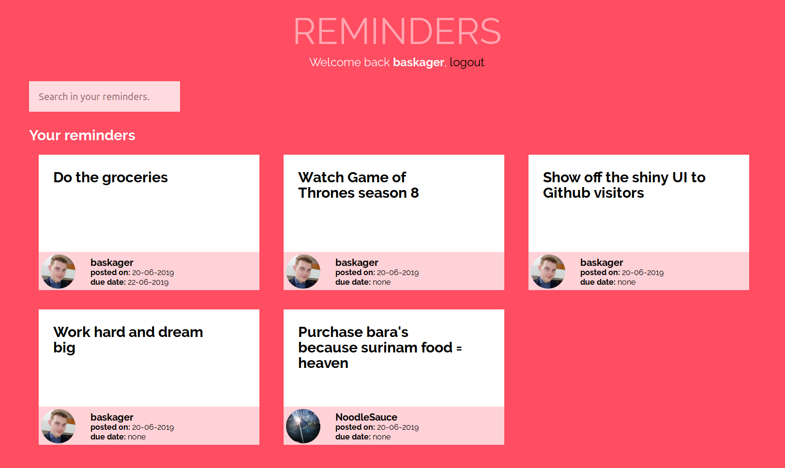
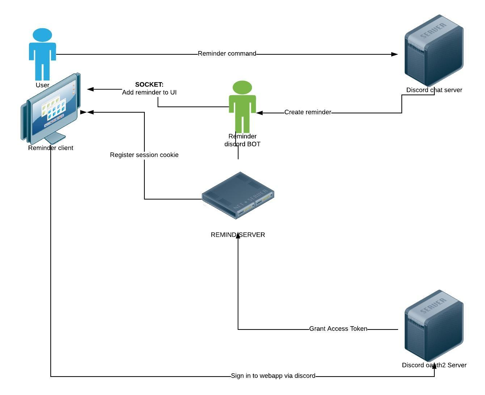

# reminder prototype
A personal reminder webapp powered by chatbots


# Goals of this project
- Use sockets to provide a real-time web experience
- Implement an external service to create reminders
- Create a modular and extendeable codebase, so that plugins for additional external services can
- Learn how to implement OAUTH2 in NodeJS
- Learn security aspects of NodeJS and Express

# Highlights of this prototype
- Real-time UI with sockets
- Modular and extendable codebase
- Chatbot integration
- External service integration with OAUTH2

# Installation guide
Need help? You can contact me via the contact form on my website: https://kager.io/contact

## 1. Clone this project
```bash
git clone git@github.com:baskager/real-time-web-project.git
```
## 2. Create a config file
An example config is available, you can copy this and configure Reminder to your liking. **The following should be done to get your copy up and running:**

#### Rename config.example.js
```bash
mv config.example.js config.js
```

#### Rename credentials.example.env
```bash
mv credentials.example.env credentials.env
```
#### Set database root password
Edit credentials.env and enter a secure passord

## 3. Set up the database and session store

#### Install docker
[Docker CE installation guide](https://docs.docker.com/install/)

#### Run docker instances
**On development**
```bash
cd reminder && docker-compose -f docker-compose.dev.yml up -d
```
**On production**
```bash
cd reminder && docker-compose up -d
```
## 4. Edit the config.js

#### Configure the session secret
Come up with a random session secret and copy it into **config.js**

#### Configure the database
1. Log into the arangoJS interface (runs on port 8529, e.g. http://localhost:8529)
    - User: root
    - Password: password you set in the **credentials.env** file
1. Create a new user
1. Copy the new username and password into **config.js**

#### Sign up your Discord app
1. Create an app on the [Discord developer portal](https://discordapp.com/developers/applications/)
1. Copy the Discord client ID and client secret into config.js
1. Create a bot user in your Discord application in the Discord developer portal
1. Copy the bot token into config.js

## 5. **For production environments:** set verify endpoint URI in config.js
Edit the verify endpoint URI to reflect your installation. This should be: `https://[[YOUR URI]]/verify`

# Starting the app
An installation of [NodeJS](https://nodejs.org/en/) and [Gulp](https://gulpjs.com/) is required for this to work.
## On development
#### Install dependencies
```bash
cd /app
npm install nodemon -g
npm install
```
#### Start the Gulp watch task (keep this running during development)
```bash
gulp watch
```
#### Start the server (in a seperate command prompt tab)
```bash
DEBUG=remind-server:* nodemon server.js
```
The DEBUG environment variable enables the application to log information to the command prompt during development

## On production
#### Install dependencies
```
cd /app
npm install forever -g 
npm install
gulp build
```
#### Start server and run forever
```bash
forever start server.js
```

# Adding the discord bot to your server
Edit the URI below by editing the client ID and visit it in your favourite browser

`https://discordapp.com/api/oauth2/authorize?client_id=[[INSERT CLIENT ID HERE]]&scope=bot&permissions=84032`

# Creating a reminder 
In your chat server, enter:
```
!remind @username to [[your reminder]]
```
or
```
!remind @username to [[your reminder]] on DD-MM-YYY
```
# Architecture


# Roadmap
This project has recently been evaluated by the instructors of the Minor Web Development at the University of Applied Sciences Amsterdam. They were very positive about this project and it has received an 8/10 grade.

I will continue to work on this project because there is an increasing demand for this app to be used and because I am not finished learning. People who have tested or seen a demo of this prototype want to use it in production. A seperate repository will be made to put this app into production. The following will be done before official release:

- [ ] Easier installation process
- [ ] Add a consent command to the bot to prevent users being spammed endlessly ("!remind on" should be sent on servers where the user would like to use the bot)
- [ ] Use Oauth2+JWT on application endpoints
- [ ] Overview of finished reminders of the past 14 days (Reminders are already soft-deletd, this should be a simple query)
- [ ] Feature where finished reminders can be recovered (reset soft delete timestamp in database to NULL)
- [ ] Service worker enhancements
    - Offline functionalities
    - Push messages
    - Caching
- [ ] Defensive coding principles
- [ ] Researched GraphQL relevance on endpoints
- [ ] Research publishing this as an open-source and standalone NPM module which can be installed locally
- [ ] Research releasing this application as a cloud service.
- [ ] Research how to make this application scalable (Docker swarm? Kubernetes?, seperation into microservices). Docker is already used to install and run ArangoDB and Redis.


# Current integrations
- Discord

# Possible future integrations
- Slack
- Messenger

## Dependencies
#### Back-end
- NodeJS
- Docker
    - ArangoDB
    - Redis
- NPM (package.json)
    - debug
    - express
    - express-handlebars
    - arangoJS
    - socket.io
    - moment.js
    - request-promise-native
    - redis (client)
    - redis-store
    - node-session
    - express-session
- NPM dev dependencies
    - ESlint

#### Front-end
- sass
- handlebars (processed by express-handlebars)
- gulp
- moment.js
- socket.io
